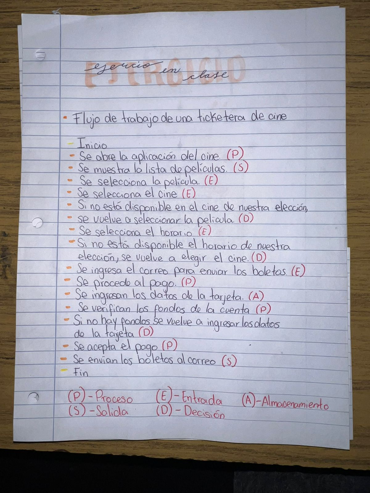
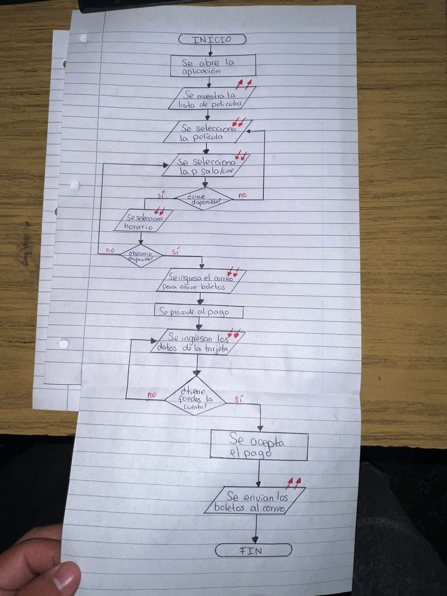
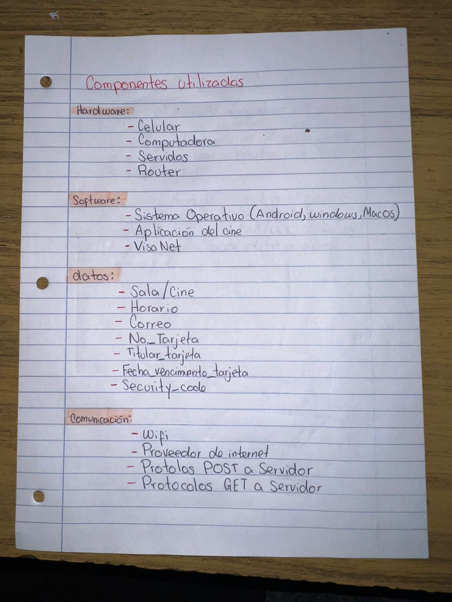
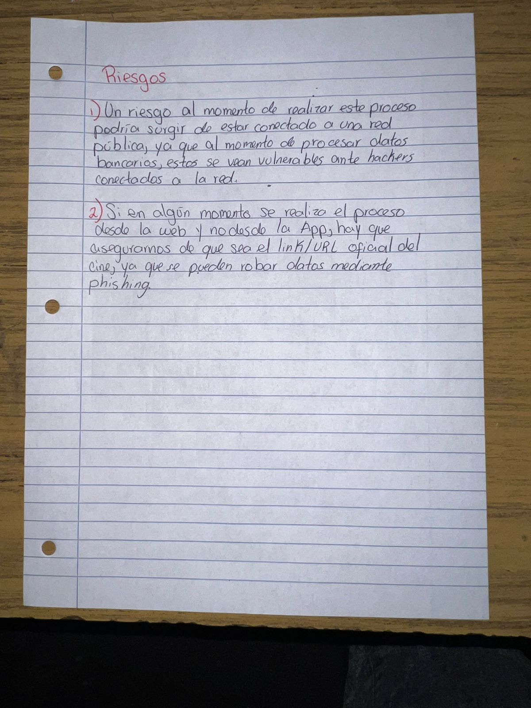
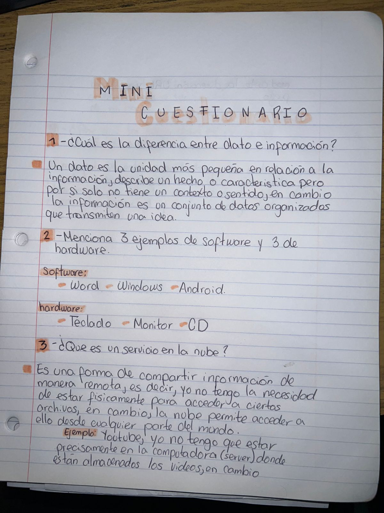
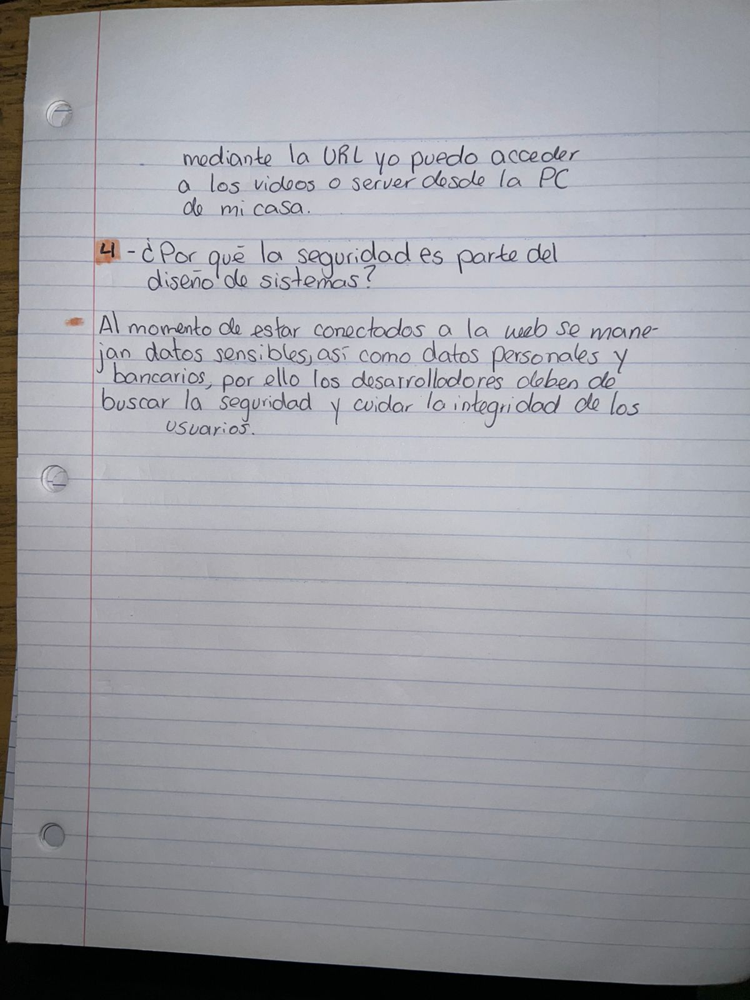
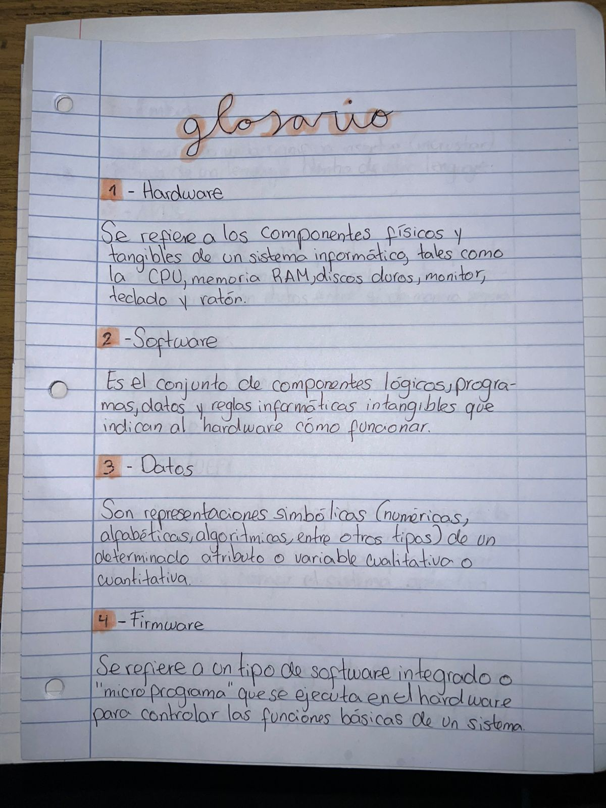
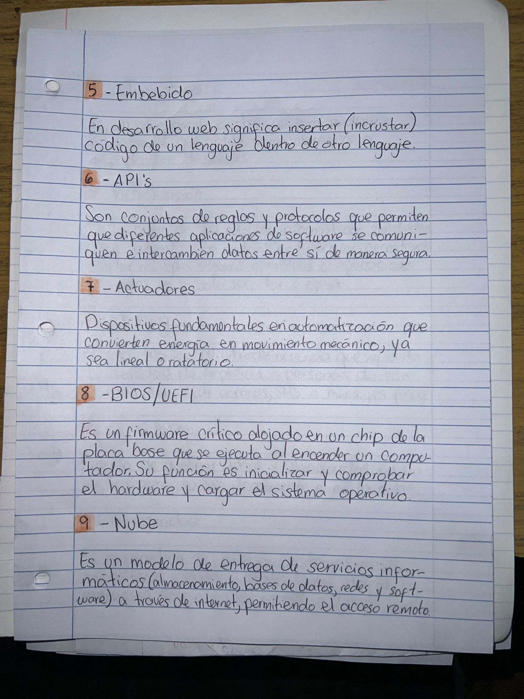
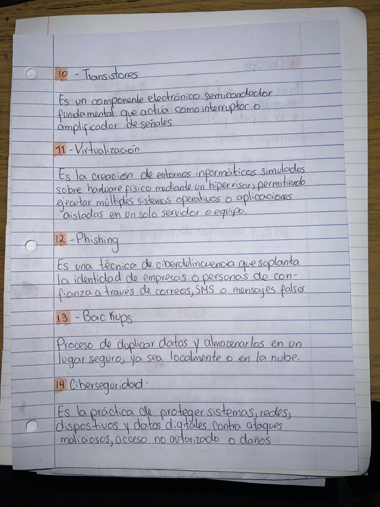
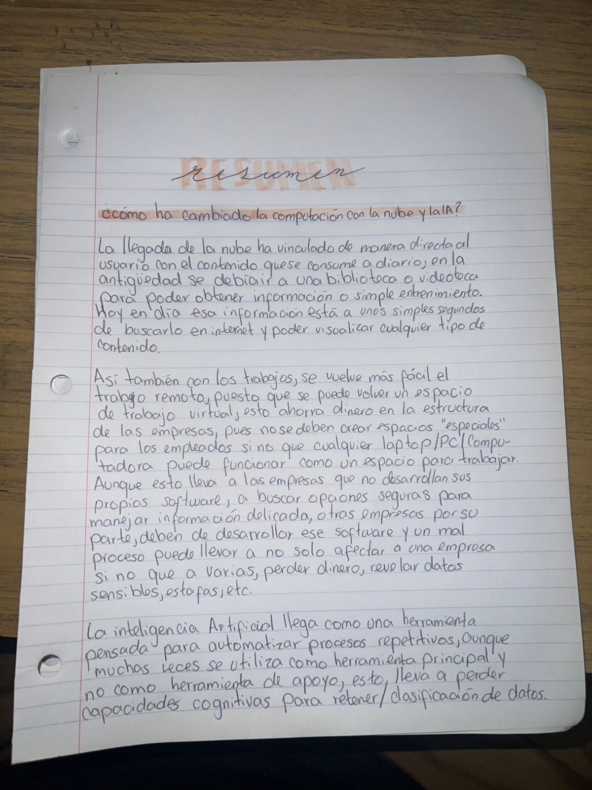

# ISC-S1

## 3590-26-6664 / Braulio José Alexander Guarcax Lima
---
## Semana 1  

## Actividad en Clase

Ver capturas

 

## Mini-Cuestionario

Ver capturas

 

## Tarea Semanal

Ver capturas

 

━━━━━━━━━━━━━━━━━━━━━━━━━━━━━━

---

## Semana 2
